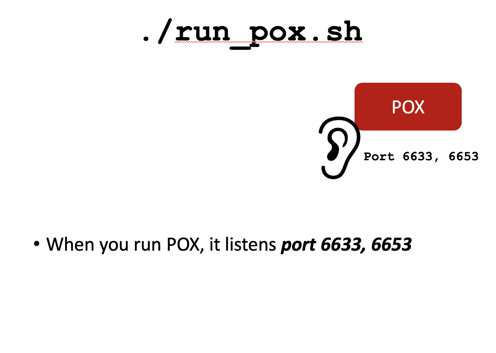
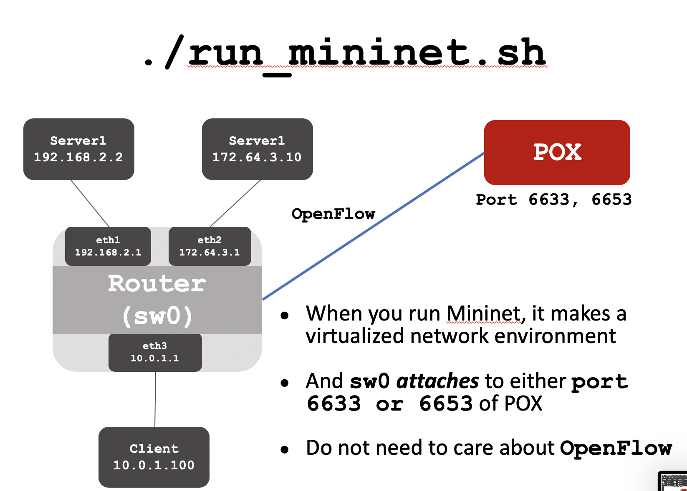
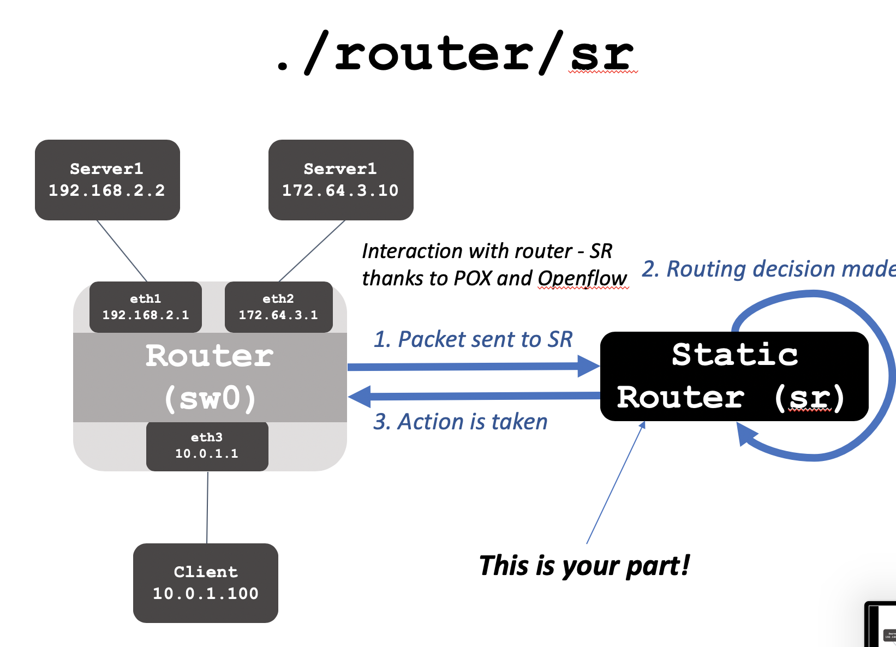

# simple-router
This is implementation of static router. (Still has some bugs remaining)
First run pox and mininet to create virtual environment. Then run sr_router.c

For detailed explanation, refer to explanation.pptx and code_explanation

